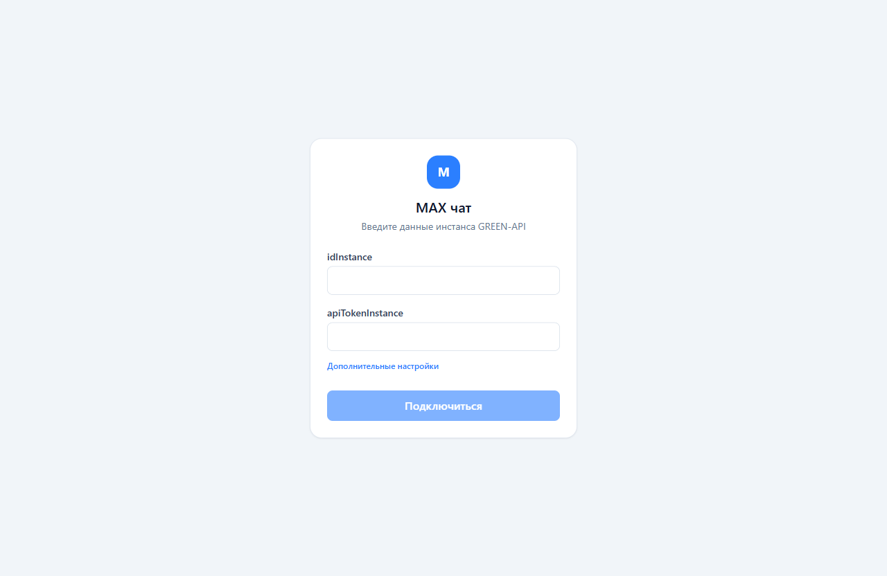
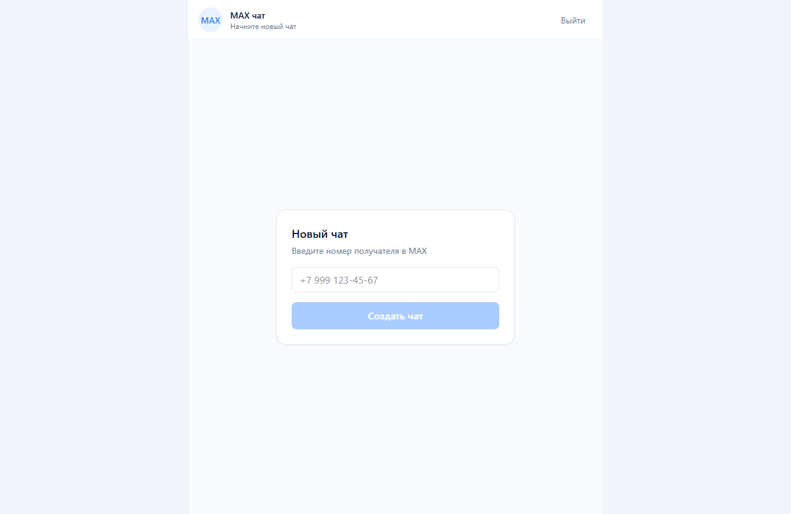
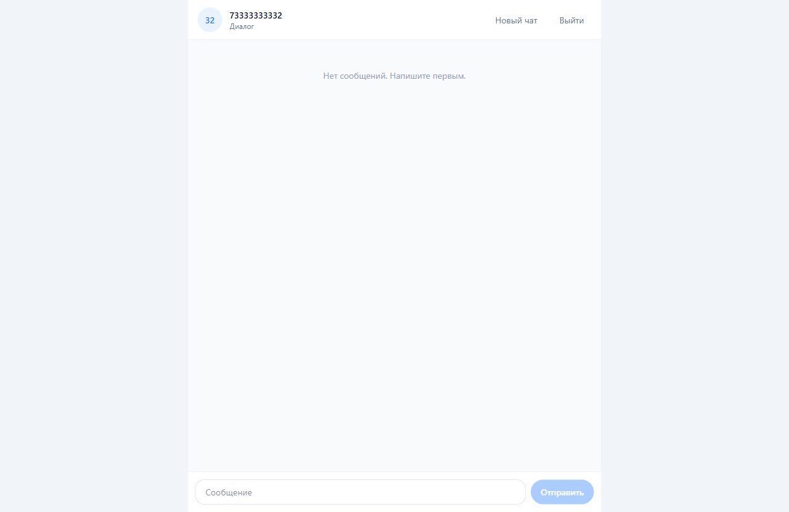

# green-api-chat

SPA-приложение для чата на React + Vite + Tailwind CSS с типизацией на TypeScript.

## 🛠 Стек

- **React 19** + **Vite 8**
- **TypeScript**
- **Tailwind CSS 4** (`@tailwindcss/vite`)
- **oxlint** + **oxlint-tsgolint** — линтинг и проверка типов (type-aware)
- **oxfmt** — форматирование
- **Docker** — запуск окружения разработки

## 🚀 Запуск проекта в IDE

1. Установить зависимости:

   - `npm install` — установит все зависимости.

2. Запустить приложение в режиме разработки:

   - `npm start` — запускает приложение в режиме разработки.

Приложение будет доступно по адресу http://localhost:5173.

## 📜 Скрипты

- `npm install` — установит все зависимости.
- `npm start` — запускает приложение в режиме разработки.
- `npm run build` — собирает файлы проекта в один каталог.
- `npm run type:check` — запускает oxlint-tsgolint (`oxlint --type-aware --type-check`) для
  type-aware проверки и типов.
- `npm run lint` — запускает oxlint для проверки ts,tsx файлов.
- `npm run format` — запускает oxfmt для форматирования файлов проекта.
- `npm run format:check` — проверяет форматирование oxfmt без изменения файлов.
- `npm run check` — запускает всех проверок параллельно через `concurrently`.

## 💬 Прототип чата MAX

SPA-чат для отправки и получения **текстовых** сообщений в мессенджере MAX через сервис
[GREEN-API](https://green-api.com/max).

**Как пользоваться:**

1. Открыть приложение и ввести учётные данные инстанса GREEN-API: `idInstance` и
   `apiTokenInstance` (при необходимости — `apiUrl` в «Дополнительных настройках»).
2. Ввести номер телефона получателя — создаётся новый чат.
3. Написать сообщение и отправить.
4. Ответ получателя из MAX появится в ленте автоматически.

**Реализация:**

- отправка — метод `sendMessage`;
- получение — HTTP API (`receiveNotification` + `deleteNotification`, long-polling);
- учётные данные хранятся в `localStorage` (кнопка «Выйти» очищает их);
- интерфейс — минималистичный, по мотивам [web.max.ru](https://web.max.ru/).

**Что нужно для проверки:**

- **авторизованный инстанс** MAX в личном кабинете GREEN-API (привязка аккаунта MAX через QR или
  номер + код; номер РФ или РБ);
- **второй аккаунт MAX** — чтобы ответить на сообщение и увидеть ответ в чате;
- получателя желательно добавить в контакты, иначе возможен статус `suspended` при отправке
  незнакомцу.

## Скриншоты

- [Экран входа](src/images/01-login.png)
- [Новый чат](src/images/02-new-chat.png)
- [Чат](src/images/03-chat.png)

| Экран входа                             | Новый чат                                | Чат                            |
| --------------------------------------- | ---------------------------------------- | ------------------------------ |
|  |  |  |

##  🐳 Развертывание проекта в Docker

1. Выполнить пункт 1 из «Запуск проекта в IDE» (клонировать репозиторий и перейти в каталог
   проекта) — устанавливать зависимости локально не требуется, они ставятся внутри контейнера.
2. Собрать образ и запустить приложение в dev-режиме:

   - `docker compose build`
   - `docker compose run --rm node npm install`
   - `docker compose up`

   Приложение будет доступно по адресу http://localhost:5173.

3. `docker compose run --rm node npm run type:check` — Проверка типов через oxlint-tsgolint.
4. `docker compose run --rm node npm run lint` — Запуск oxlint.
5. `docker compose run --rm node npm run format` — Запуск oxfmt.
6. `docker compose run --rm node npm run format:check` — Проверка форматирования oxfmt.
7. `docker compose run --rm node npm run check` — Запуск всех проверок параллельно.
